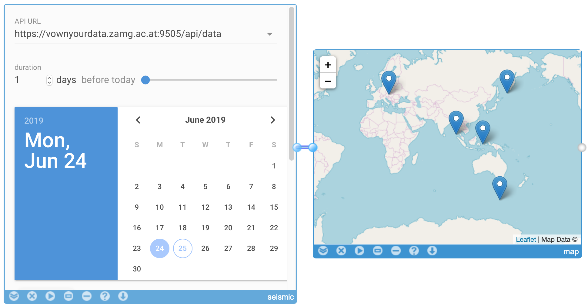
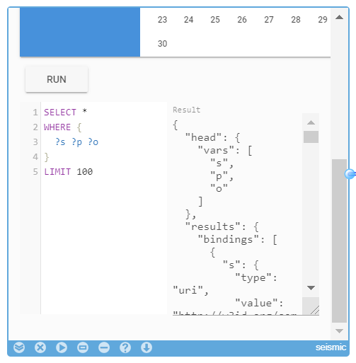

# SEMCON Seismic Use-case Mashup

The graphical user interface for `sc-sparql` that is connected to `sc-seismic` is available in the following [link](https://rebrand.ly/sc-seismic-sparql)

On the left side you will see [sc-seismic-sparql](http://pebbie.org/mashup/widget/sc_seismic_sparql) widget where you can change the source `sc-seismic` API URL and the duration parameter to the API. 
You can use the text box, slider, or specify the start date using the date picker (*note: the duration is limited to 365 days*). 

If you scroll down the widget you will see the SPARQL query editor with a default query (*left-hand side*) and the query result visualization on a map widget (*right-hand side*) that represent seismic activities.
You can click on each item (seismic activity) on the map to get more information about it.

The current visualization is based on the default SPARQL query. You can adjust the query by specifying the SPARQL query that you want to execute (scroll down in the query panel to get into the SPARQL query box) and re-run the widget (click on play/triangle button) to get the updated result on the map. 
